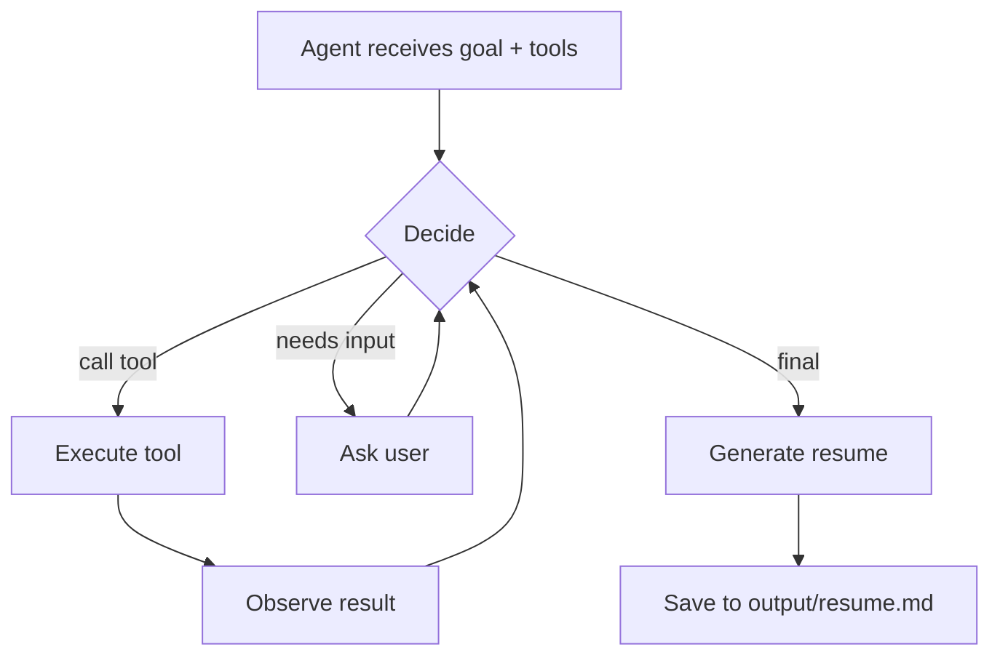

# Agentic Loop Demo

A Python CLI that demonstrates the **decide → tool → observe → repeat** pattern, all without a real LLM. No API keys, no model calls — it exists to make the agentic loop visible in under 30 seconds.

> [!IMPORTANT]
> This is a mock project. The adapter follows a scripted sequence. It doesn't call a real LLM or produce real resumes. The value is the architecture: loop structure, tool dispatch, state management, agent/harness separation.

## What it demonstrates

- **Agent** — a decision-making component (`MockAdapter`) that receives context and chooses the next action
- **Agentic loop** — the repeated decide → tool → observe → decide cycle in `main.py`
- **Harness** — the runtime connecting the agent to tools, database, and CLI
- **Tool interface** — the agent queries experience, searches bullets, asks questions, and generates output through defined tools

<details>
<summary><strong>For AI Agents</strong></summary>

**Stack:** Python 3.13, Pydantic v2, SQLite3, pytest 9.x.

**Mock cold run (zero to running):**
```bash
git clone https://github.com/djmoore711/Agentic-Loop-Demo.git && cd Agentic-Loop-Demo
python3 -m venv .venv && source .venv/bin/activate
pip install -r requirements.txt
python main.py init && python main.py seed
python main.py start --file sample_data/sample_job_description.txt
```

**Verify it works:**
```bash
python -m pytest    # exit 0 = all pass
```

**Entry point:** `main.py` → `run_loop()` is the agentic loop.

**Environment:** `RESUME_DB_PATH` — SQLite path (default: `experience_kb.db`).

**Boundaries — do not modify:**
- `sample_data/` — test fixtures
- `references/` — design notes, not code
- `.venv/`, `output/`, `*.db` — generated artifacts (gitignored)
- `requirements.txt` — do not add new dependencies without asking

</details>

## Installation / Quickstart

```bash
git clone https://github.com/djmoore711/Agentic-Loop-Demo.git
cd Agentic-Loop-Demo
python3 -m venv .venv
source .venv/bin/activate
pip install -r requirements.txt
python main.py init
python main.py seed
python main.py start --file sample_data/sample_job_description.txt
```

## Configuration

| Variable | Purpose | Default | Required |
|----------|---------|---------|----------|
| `RESUME_DB_PATH` | Path to the SQLite database file | `experience_kb.db` | No |

## Architecture

```
main.py          CLI entry point and agentic loop
llm_adapter.py   Mock adapter (the "Agent")
models.py        Pydantic data models
tools.py         Tool functions and dispatch
database.py      SQLite state manager
analyzer.py      Job description keyword analysis
generator.py     Resume generation from evidence
extractor.py     URL / file / text extraction
prompts.py       Prompt templates

sample_data/     Sample job description and user profile
tests/           Pytest test suite
output/          Generated resumes (gitignored)
```

The loop flow:



## Testing

```bash
source .venv/bin/activate
python -m pytest
```

29 tests across analyzer, generator, tools, and the mock adapter state machine. Each test is isolation-safe — `conftest.py` manages a temporary database per session.

## Known limitations

- Mock adapter follows a fixed sequence — it simulates rather than truly deciding
- User answers in interactive mode are stored but not yet used in resume generation
- URL extraction may fail on JavaScript-rendered pages

## License

MIT — see [LICENSE](./LICENSE).
