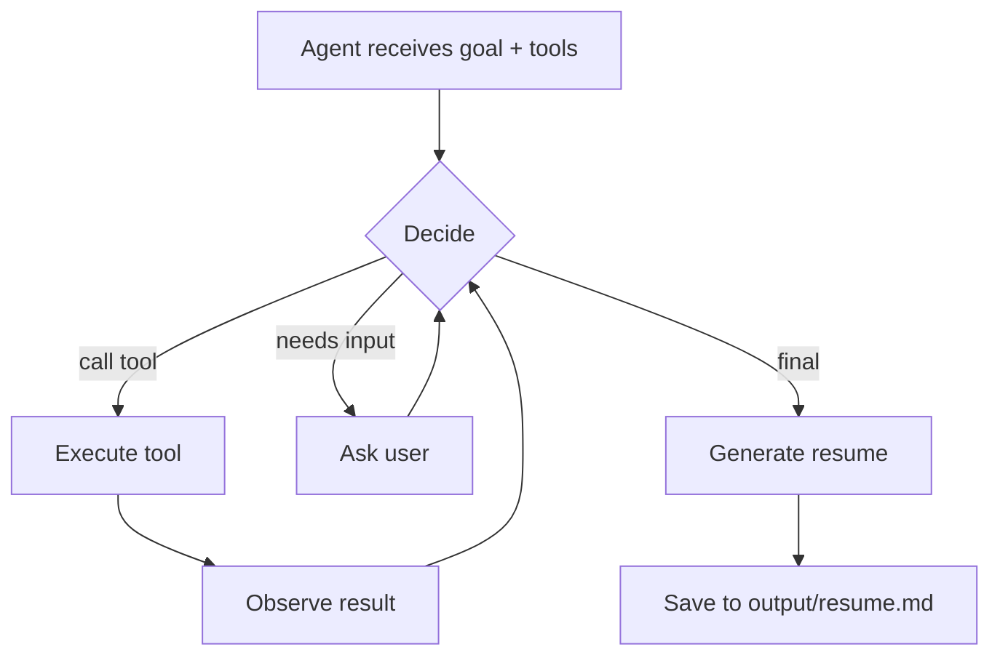

# Agentic Loop Demo

A Python CLI that demonstrates the **decide → tool → observe → repeat** pattern, all without a real LLM. No API keys, no model calls — it exists to make the agentic loop visible in under 30 seconds.

> [!IMPORTANT]
> This is a mock. The adapter follows a scripted sequence. It doesn't call a real LLM or produce real resumes. The value is the architecture: loop structure, tool dispatch, state management, agent/harness separation.

## What it demonstrates

- **Agent** — a decision-making component (`MockAdapter`) that receives context and chooses the next action
- **Agentic loop** — the repeated decide → tool → observe → decide cycle in `main.py`
- **Harness** — the runtime connecting the agent to tools, database, and CLI
- **Tool interface** — the agent queries experience, searches bullets, asks questions, and generates output through defined tools

> [!TIP]
> For AI Agents
>
> - **Entry point:** `main.py` — CLI dispatches to `run_loop()` for the agentic loop
> - **Non-interactive run:** `python main.py start --text "job description here"`
> - **Env vars:** `RESUME_DB_PATH` — path to SQLite DB (default: `experience_kb.db`)
> - **Tests:** `python -m pytest` — exit 0 = pass, non-zero = fail
> - **Constraints:** Do not modify files under `sample_data/` — they are test fixtures. Do not modify `references/` — they are design notes.

## Installation / Quickstart

```bash
git clone https://github.com/djmoore711/Agentic-Loop-Demo.git
cd Agentic-Loop-Demo
python3 -m venv .venv
source .venv/bin/activate
pip install -r requirements.txt
python main.py init
python main.py seed
python main.py start --file sample_data/sample_job_description.txt
```

## Usage

```bash
python main.py start --file <path>              # Read from a file
python main.py start --url <url>                # Fetch from a URL
python main.py start --text "<raw text>"        # Pass inline text
python main.py start --file <path> --interactive  # Enable user prompts
```

| Command | Description |
|---------|-------------|
| `init` | Create the SQLite database schema |
| `seed` | Load fictional sample data (profile, experience, bullets, tools) |
| `db-summary` | Print table row counts |
| `start` | Run the agentic loop on a job description |
| `export` | Export the most recent resume |
| `interactive` | Paste a job description and run interactively |

### Expected output

```
╭──────────────────────────────────────────────────╮
│                    Harness                        │
│  Agentic Loop Starting                            │
│  Mode: mock                                       │
│  Job: Senior Security Automation Engineer         │
│  Company: Nexus Dynamics                          │
│  Max iterations: 8                                │
╰──────────────────────────────────────────────────╯

--- Iteration 1/8 ---
  Agent decision: call tool query_tools
  Observation: {"count": 1, "tools": [{"tool_name": "Python", ...}]}...

--- Iteration 6/8 ---
  Agent decision: produce final resume
Resume saved to: ./output/resume.md
```

## Configuration

| Variable | Purpose | Default | Required |
|----------|---------|---------|----------|
| `RESUME_DB_PATH` | Path to the SQLite database file | `experience_kb.db` | No |

## Architecture

```
main.py          CLI entry point and agentic loop
llm_adapter.py   Mock adapter (the "Agent")
models.py        Pydantic data models
tools.py         Tool functions and dispatch
database.py      SQLite state manager
analyzer.py      Job description keyword analysis
generator.py     Resume generation from evidence
extractor.py     URL / file / text extraction
prompts.py       Prompt templates

sample_data/     Sample job description and user profile
tests/           Pytest test suite
output/          Generated resumes (gitignored)
```

The loop flow:



## Testing

```bash
source .venv/bin/activate
python -m pytest
```

29 tests across analyzer, generator, tools, and the mock adapter state machine. Each test is isolation-safe — `conftest.py` manages a temporary database per session.

## Known limitations

- Mock adapter follows a fixed sequence — it simulates rather than truly deciding
- User answers in interactive mode are stored but not yet used in resume generation
- URL extraction may fail on JavaScript-rendered pages

## License

MIT — see [LICENSE](./LICENSE).
